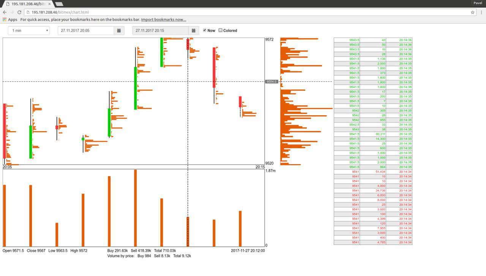

# bitmex
Horizontal volumes for bitmex exchange. Use the HTML5 Canvas element to draw graphics.



Files:
```
.idea - PhpStorm project
trades.php - script for adding new trades to database (must be permanently running, see trades.service)
trades.service - ubuntu systemd service (for trades.php)
```

Files for Web (example):
```
root@horizontalvol:/var/www/html/bitmex# ls -la
total 60
drwxr-xr-x 6 root root  4096 Nov 23 14:46 .
drwxr-xr-x 8 root root  4096 Feb  7 19:20 ..
drwx------ 5 root root  4096 Nov 23 13:26 SwaggerClient-php
-rw-r--r-- 1 root root   688 Nov 27 18:13 chart.css
-rw-r--r-- 1 root root  7240 Nov 27 18:13 chart.html
-r--r--r-- 1 root root 19860 Nov 27 18:13 chart.js
drwxr-xr-x 2 root root  4096 Nov 23 13:26 css
drwxr-xr-x 2 root root  4096 Nov 23 13:26 fonts
-rw-r--r-- 1 root root   715 Nov 24 16:55 get_data.php
drwxr-xr-x 2 root root  4096 Nov 23 13:26 js
root@horizontalvol:/var/www/html/bitmex# 
```

cron task for delete_old_trades.php:
```
0 * * * * /usr/bin/php /root/bitmex/delete_old_trades.php
```

Database:
```
mysql> show create database bitmex;
+----------+-----------------------------------------------------------------+
| Database | Create Database                                                 |
+----------+-----------------------------------------------------------------+
| bitmex   | CREATE DATABASE `bitmex` /*!40100 DEFAULT CHARACTER SET utf8 */ |
+----------+-----------------------------------------------------------------+
1 row in set (0.00 sec)

mysql>
```

Tables in the database (see create_database.txt file):
```
mysql> show tables;
+------------------+
| Tables_in_bitmex |
+------------------+
| trades           |
+------------------+
1 row in set (0.00 sec)

mysql> 

```

Files for replacing [password] with your database password:
```
delete_old_trades.php
trades.php
get_data.php
```
